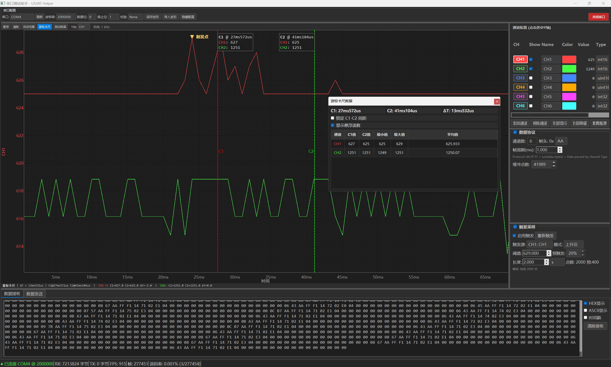

# USART Helper

USART Helper 是一款面向嵌入式调试场景的 Windows 串口波形分析工具。软件用于接收设备通过 USART/串口输出的二进制采样帧，实时解析多通道数据，并提供连续采样、触发采样、波形保存/导入、游标测量和通道配置等功能。

## 主要功能

- 串口连接：支持端口选择、刷新、波特率、数据位、停止位、校验位配置。
- 实时波形显示：基于 PyQt5 + pyqtgraph，支持多通道实时绘制。
- 默认 6 通道：通道配置界面默认显示 6 个通道，支持添加和删除通道。
- 通道配置：支持设置通道名称、颜色、显示/隐藏、数据类型、单位。
- 独立 Y 轴：各通道保留独立 Y 轴缩放范围，可切换当前显示的 Y 轴通道。
- 时间 X 轴：X 轴显示为时间，支持 ms、s、min 等复合时间格式。
- 连续采样：串口接收后持续解析并显示波形。
- 触发采样：支持触发源、上升沿、下降沿、电平触发、阈值、预触发比例和采样长度配置。
- 触发进度：触发条件满足后，弹窗显示捕获进度和进度条。
- 触发点标记：触发点三角形始终指向触发源通道的真实触发采样值，不随 Y 轴切换改变指向。
- 游标卡尺：支持 C1/C2 双游标测量时间差、各通道 C1/C2 值、区间最小值、最大值和平均值。
- 波形保存：支持连续采样和触发采样保存为 CSV。
- 波形导入：支持导入已保存的 CSV 波形，导入后可继续缩放查看和使用游标卡尺。
- 配置栏隐藏：右侧通道配置栏可隐藏/显示。
- 独立发布：可打包为无需目标电脑安装 Python 的 Windows 独立程序或安装包。


## 数据协议

软件默认解析如下二进制帧格式：

```text
AA FF F1 Len Payload SC1 SC2
```

字段说明：

- `AA FF F1`：固定帧头。
- `Len`：Payload 的字节数，不包含帧头和校验字节。
- `Payload`：通道数据，从 CH1 开始按当前通道数据类型依次解析。
- `SC1 SC2`：两个 8 位滚动和校验字节。

帧总长度：

```text
4 字节头部 + Len 字节数据 + 2 字节校验 = Len + 6
```

校验方式：

```text
SC1 = SC1 + byte
SC2 = SC2 + SC1
```

校验范围为从 `AA` 到最后一个 Payload 字节。

支持的数据类型：

```text
int8, uint8, int16, uint16, int32, uint32, int64, uint64, float32, float64
```

默认通道数据类型顺序：

```text
int16, int16, uint16, uint16, int32, int32, int32, int16, int16, int16
```

### C 语言发送 Demo

下面示例按照软件默认 6 通道配置打包一帧数据：

```text
CH1 int16, CH2 int16, CH3 uint16, CH4 uint16, CH5 int32, CH6 int32
```

对应 Payload 长度为：

```text
2 + 2 + 2 + 2 + 4 + 4 = 16 字节
```

示例代码：

```c
#include <stdint.h>
#include <stddef.h>

#define USART_FRAME_HEADER0 0xAA
#define USART_FRAME_HEADER1 0xFF
#define USART_FRAME_HEADER2 0xF1

static void write_i16_le(uint8_t *buf, int16_t value)
{
    uint16_t v = (uint16_t)value;
    buf[0] = (uint8_t)(v & 0xFF);
    buf[1] = (uint8_t)((v >> 8) & 0xFF);
}

static void write_u16_le(uint8_t *buf, uint16_t value)
{
    buf[0] = (uint8_t)(value & 0xFF);
    buf[1] = (uint8_t)((value >> 8) & 0xFF);
}

static void write_i32_le(uint8_t *buf, int32_t value)
{
    uint32_t v = (uint32_t)value;
    buf[0] = (uint8_t)(v & 0xFF);
    buf[1] = (uint8_t)((v >> 8) & 0xFF);
    buf[2] = (uint8_t)((v >> 16) & 0xFF);
    buf[3] = (uint8_t)((v >> 24) & 0xFF);
}

static void calc_checksum(const uint8_t *buf, size_t len,
                          uint8_t *sc1, uint8_t *sc2)
{
    uint8_t s1 = 0;
    uint8_t s2 = 0;

    for (size_t i = 0; i < len; ++i) {
        s1 = (uint8_t)(s1 + buf[i]);
        s2 = (uint8_t)(s2 + s1);
    }

    *sc1 = s1;
    *sc2 = s2;
}

/*
 * out 至少需要 22 字节：
 * 3 字节帧头 + 1 字节 Len + 16 字节 Payload + 2 字节校验
 */
size_t build_usart_helper_frame(uint8_t *out,
                                int16_t ch1,
                                int16_t ch2,
                                uint16_t ch3,
                                uint16_t ch4,
                                int32_t ch5,
                                int32_t ch6)
{
    const uint8_t payload_len = 16;
    size_t offset = 0;

    out[offset++] = USART_FRAME_HEADER0;
    out[offset++] = USART_FRAME_HEADER1;
    out[offset++] = USART_FRAME_HEADER2;
    out[offset++] = payload_len;

    write_i16_le(&out[offset], ch1);
    offset += 2;
    write_i16_le(&out[offset], ch2);
    offset += 2;
    write_u16_le(&out[offset], ch3);
    offset += 2;
    write_u16_le(&out[offset], ch4);
    offset += 2;
    write_i32_le(&out[offset], ch5);
    offset += 4;
    write_i32_le(&out[offset], ch6);
    offset += 4;

    calc_checksum(out, offset, &out[offset], &out[offset + 1]);
    offset += 2;

    return offset;
}

void example_send_frame(void)
{
    uint8_t frame[22];
    size_t frame_len = build_usart_helper_frame(
        frame,
        629,     /* CH1 */
        1249,    /* CH2 */
        0,       /* CH3 */
        0,       /* CH4 */
        0,       /* CH5 */
        0        /* CH6 */
    );

    /*
     * 将这里替换成实际平台的串口发送函数，例如：
     * HAL_UART_Transmit(&huart1, frame, frame_len, 100);
     * uart_write(frame, frame_len);
     */
    (void)frame;
    (void)frame_len;
}
```

如果在软件的“通道配置”中修改了通道数量或数据类型，设备端也需要按相同顺序修改 Payload 写入顺序和 `Len` 字段。

## 波形保存格式

波形保存为 CSV 文件，默认文件名格式：

```text
DataX_YYYYMMDD.csv
```

其中 `X` 表示当天保存次数，例如：

```text
Data1_20260707.csv
Data2_20260707.csv
```

保存时可以重命名文件并选择保存路径。

CSV 元数据包含：

- `Type`：连续采样或触发采样。
- `SavedAt`：保存时间。
- `SampleIntervalMs`：采样间隔。
- `TriggerSampleIndex`：触发采样点索引，仅触发采样保存。
- `TriggerChannelIndex`：触发源通道索引，仅触发采样保存。

数据表字段：

```text
Sample, Time_ms, CH1:Name(Unit), CH2:Name(Unit), ...
```

## 运行开发版

开发电脑需要安装 Python 和依赖。

建议使用 Python 3.9 或更高版本。

```powershell
python -m venv .venv
.\.venv\Scripts\activate
python -m pip install --upgrade pip
python -m pip install -r requirements.txt
python main.py
```

依赖：

```text
PyQt5
pyqtgraph
pyserial
numpy
```

## 打包为可安装软件

如果希望在另一台电脑上像普通软件一样运行，并且不安装 Python、PyQt5、numpy 等环境，可以使用项目内置的 Windows 打包脚本。

生成独立版：

```powershell
.\build_windows.ps1 -Clean
```

输出：

```text
dist\USART Helper\USART Helper.exe
```

把整个 `dist\USART Helper` 文件夹复制到另一台电脑即可运行。

生成安装包需要构建电脑安装 Inno Setup 6：

```powershell
.\build_windows.ps1 -Clean -Installer
```

输出：

```text
installer_output\USART_Helper_Setup.exe
```

目标电脑不需要安装 Python 或 Inno Setup，只需要具备串口设备对应的系统驱动。

更详细的打包说明见 [PACKAGING.md](PACKAGING.md)。
注：项目中已经编译完成安装包目录为：".\USART_Helper\installer_output\USART_Helper_Setup.exe"
## 项目结构

```text
USART_Helper/
├── main.py                  # 程序入口
├── main_window.py           # 主窗口、串口界面、触发采样、保存导入
├── waveform_widget.py       # 多通道波形显示、缩放、游标卡尺、触发点标记
├── channel_config.py        # 通道配置面板
├── data_parser.py           # 二进制串口协议解析
├── serial_handler.py        # 串口收发封装
├── test_simulator.py        # 测试数据模拟器
├── requirements.txt         # 运行依赖
├── requirements-build.txt   # 打包依赖
├── build_windows.ps1        # Windows 一键打包脚本
├── USART_Helper.spec        # PyInstaller 配置
├── installer/               # Inno Setup 安装包脚本
└── PACKAGING.md             # 打包与安装说明
```

## 使用提示

- 高速串口采样时，建议先确认设备输出帧格式和通道数据类型一致。
- 如果波形显示异常，优先检查 `Len`、通道数据类型、通道数量和校验字节。
- 触发采样修改触发源、阈值、预触发比例等参数后，不会自动重新触发，需要点击“重新触发”。
- 导入触发采样 CSV 时，如果文件包含 `TriggerChannelIndex`，触发点会恢复到原触发源通道。
- 目标电脑运行打包版时不需要 Python，但串口芯片驱动仍需按硬件要求安装。
